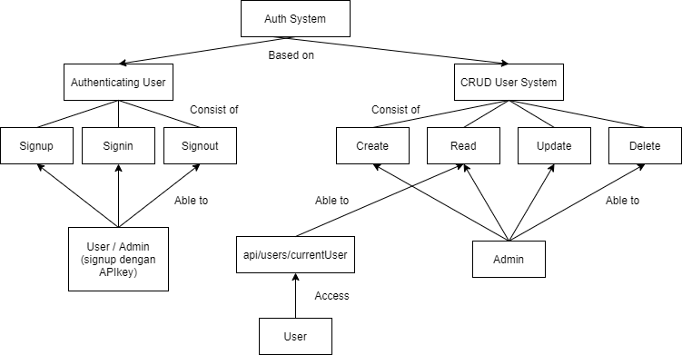

# Kubernetes load balancer

    

### Deskripsi Deployment
IP address akses: 34.101.155.211  
Pod kubernetes: auth, dan user  
Load balancer: ingress nginx  
Region server/vps: Asia-southeast2  
dokumentasi pod: 
 - 34.101.155.211/api/auth/docs
 - 34.101.155.211/api/users/docs (perhatikan beberapa suffixes pada akhir endpoint yang harus didelete)
lokasi script (.yaml): /infra/k8s

### Contoh penggunaan sederhana
Kredensial role admin: 
 - username: test@test.com
 - password: password
 
Lakukan POST request ke 34.101.155.211/api/auth/signin (memasukan session user)
Melakukan akses crud users: Lakukan GET request ke 34.101.155.211/api/users

    

